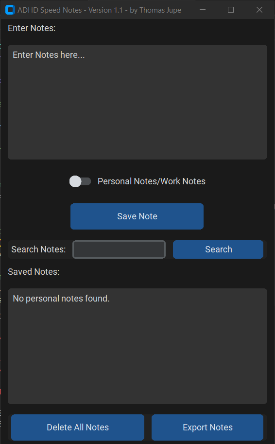
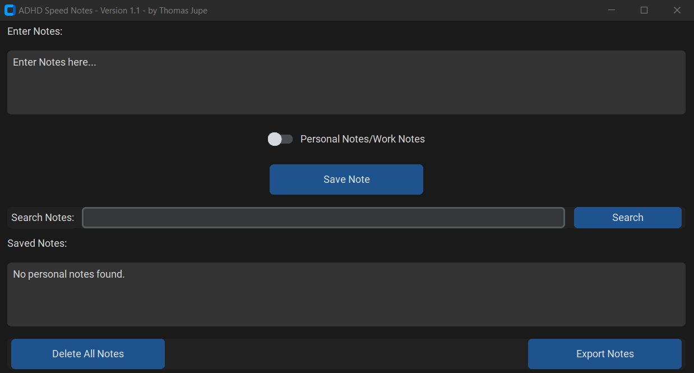

# 📝 SpeedNotes: A Distraction-Free Note-Taking App  

**SpeedNotes** is a lightweight, distraction-free note-taking application designed to help users quickly jot down and organize their thoughts without losing focus. ✨ Originally created to assist with managing my ADHD, the app ensures that taking notes is fast, seamless, and categorized for easy retrieval.

  

## 🌟 Features  
- **Quick Note Capture**: Effortlessly save notes without interruption.  
- **Category Management**: 🗂️ Toggle between "Work" and "Personal" categories to keep notes organized.  
- **Search Functionality**: 🔍 Instantly find specific notes with the built-in search tool.   
- **Export and Delete Notes**: 📂 Easily export notes to a text file or delete all notes in a category.

This app combines functionality with simplicity, empowering users to stay productive and on task. 🚀 

## 🛠️ Future Features 
- **Email Integration**: 📧 Send "Work" or "Personal" notes directly to pre-configured email addresses. 

 
---
## Overview
 Speed Notes is a simple and intuitive note-taking application designed to help users, especially those with ADHD, to quickly jot down notes without distractions. The app enables quick and easy note-saving with a timestamp, search functionality, and the ability to organize notes by categories. It’s designed to get users back to work swiftly by allowing them to focus on their task, not on the process of taking notes.

## Why it was made
 The application was created to address the needs of individuals with ADHD. The goal was to provide a simple, distraction-free environment where users could write down their thoughts quickly, ensuring they could return to their primary work without losing focus. By streamlining the process of taking notes, Speed Notes makes it easier to capture important ideas in an efficient manner.

## Dependencies
 This project uses the following Python libraries:

- **tkinter:** Python's standard GUI package for creating the graphical interface.
- **customtkinter:** A custom version of Tkinter that provides enhanced visual elements.
- **datetime:** For managing timestamps when saving notes.
- **os:** To interact with the file system and manage note files.
- **filedialog:** To provide save and open file dialogs for exporting notes.

 To **install dependencies**, use the following commands:

- bash
- Copy code
- pip install customtkinter

## Description of Operation
 **Add a Note:** Users can type notes into the large text area at the top of the screen. Once finished, they can press Enter to save the note automatically.

 **Categorize Notes:** Notes can be categorized into either "Work" or "Personal". The user can toggle between these categories using a custom switch, which will dynamically change the saved note file.

 **View Saved Notes:** All saved notes are displayed in a separate area below the text box. The notes are sorted by their timestamp, showing the date and time they were created.

 **Search Notes:** Users can search through their notes by entering a keyword in the search bar, which will filter the displayed notes.

 **Delete Notes:** Users can delete all notes from the selected category.

 **Export Notes:** Notes can be exported to a text file for backup or sharing purposes. The export function opens a dialog for the user to choose where to save the file.

## Instructions

 **Run the Program:** Simply run the Python file using your Python environment.
 
 **Write Notes:** Type your note into the text area and press Enter (or Shift+Enter for a new line) to save it.
 
 **Select Category:** Toggle between "Work" or "Personal" using the switch to categorize your note.
 
 **Search Notes:** Use the search bar to filter saved notes by keyword.

 **Delete/Export Notes:** Use the "Delete All Notes" or "Export Notes" buttons as needed.

## Problems Resolved

 **Distraction-Free Interface:** Developed to provide a clean, simple interface with no unnecessary distractions to help the user focus on taking notes.
 
 **Quick Note Saving:** Implemented a feature to automatically save the note when pressing Enter, ensuring users can capture their thoughts quickly and efficiently.
 
 **Search Functionality:** Enabled users to quickly find notes using a search bar, which is particularly helpful for retrieving information from previous sessions.
 
 **Dynamic View Box:** Adjusted the display box for notes to match the window width, providing a more responsive interface.
 
 **Text Wrapping:** Ensured text wrapping functionality in the note area for a better viewing experience, especially for long notes.
 
 **Category Switching:** Allowed for easy switching between Work and Personal categories for better note organization.
 

## Future Improvements

  **Cloud Syncing:** Ability to sync notes across multiple devices or cloud storage services.
 
  **FTP Syncing:** Ability to send notes to FTP/SFTP.
 
  **Advanced Search:** Allow for more advanced filtering options, such as date or keyword combinations.
 
  **Mobile Compatibility:** Creating a version of the app for mobile devices, providing flexibility for users on the go.
 
  **Auto Tagging:** Use smart tagging to automatically hashtag notes for advanced filtering applications.
 
---

  

---
